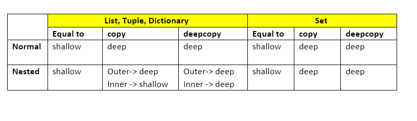

## Shallow and Deep Copy

Shallow means changes made to copied list will be reflected in the orignial list.

Deep means changes made to copied list will not be reflected in the original list.
Both List will be independent.

